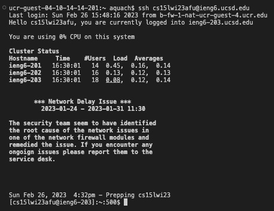

# **Lab Report 4** 
### Step 4: Log into ieng6

Keys Pressed: `<Ctrl-R> <S> <S> <enter>`
### Step 5: Clone your fork of the repository from your Github account

Keys Pressed: `<Ctrl-R> <C> <L> <O> <enter>`
### Step 6: Run the tests, demonstrating that they fail

Keys Pressed: `<C> <D> <space> <l> <tab> <enter>`, `<Ctrl-R> <j> <a> <v> <a> <c> <enter>`,` <Ctrl-R> <j> <a> <v> <a> <space> <-> <enter>`
### Step 7: Edit the code file to fix the failing test

Keys Pressed: `<n> <a> <n> <o> <space> <L> <tab> <.> <j> <tab> <enter>`, `<Ctrl-W> <ESC-B> <i> <enter> <right> <right> <right> <right> <right> <right> <backspace> <2> <Ctrl-O> <enter> <Ctrl-X>`
### Step 8: Run the tests, demonstrating that they now succeed

Keys Pressed: `<up> <up> <up> <enter>`, `<up> <up> <up> <enter>`
### Step 9: Commit and push the resulting change to your Github account

Keys Pressed: `<Ctrl-R> <a> <d> <d> <enter>`, `<Ctrl-R> <c> <o> <m> <m> <enter>`, `<Ctrl-R> 
 <u>`

