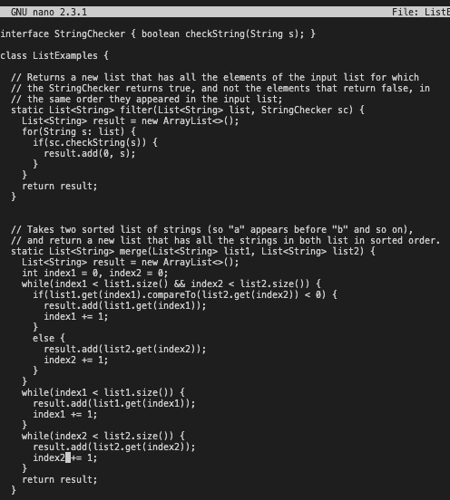

# **Lab Report 4** 
### Step 4: Log into ieng6

Keys Pressed: `<Ctrl-R> <S> <S> <enter>`
Because I already used the command `ssh cs15lwi23afu@ieng6.ucsd.edu` many times before for lab, and for this lab report, this command was already in my history. So, I used reverse search by pressing `<Ctrl-R>` and typed "ss" which allowed the terminal to find what I wanted and I just hit `<enter>`. Since I already generated a ssh key for logging into the remote server so I don't need to enter my password and am already logged into the remote server.

---
### Step 5: Clone your fork of the repository from your Github account

Keys Pressed: `<Ctrl-R> <c> <l> <o> <enter>`
Here, we are trying to clone the fork of the lab7/ repository from github. I also already generated a key and enabled it so that I can use the ssh link from github. This allows me to use the same command as before. Therefore, I reverse search again using `<Ctrl-R>` and look up "clo" for clone, then hit `<enter>`. This clones the fork of the repository onto the remote server.

---
### Step 6: Run the tests, demonstrating that they fail

Keys Pressed: `<C> <D> <space> <l> <tab> <enter>`, `<Ctrl-R> <j> <a> <v> <a> <c> <enter>`,` <Ctrl-R> <j> <a> <v> <a> <space> <-> <enter>`
To run the tests we have to change our directory so we use the command `cd` along with the file path. To make sure that we are going into the correct directory we hit "l" then tab for the terminal to autofill "lab7/" then hit enter. By doing this we ensure that "lab7/" is a directory, make minimal mistakes, and are operating efficiently. Then, because we've run the command `javac -cp .:lib/hamcrest-core-1.3.jar:lib/junit-4.13.2.jar *.java` to compile Junit tests before we can use reverse search again. After that we need to run the tests using `java -cp .:lib/hamcrest-core-1.3.jar:lib/junit-4.13.2.jar org.junit.runner.JUnitCore` which is something we've done before. So, we use reverse search once again and run the Junit tests.

---
### Step 7: Edit the code file to fix the failing test

Keys Pressed: `<n> <a> <n> <o> <space> <L> <tab> <.> <j> <tab> <enter>`, `<Ctrl-W> <ESC-B> <i> <enter> <right> <right> <right> <right> <right> <right> <backspace> <2> <Ctrl-O> <enter> <Ctrl-X>`
To edit the file in the terminal we are going to use a built-in editor called nano. We simply use the command `nano` then the file path. So here, we type out "nano" then since we want to edit the file ListExamples.java, we type "L" then hit <tab>. This should autofill to "ListExamples". Because there is a .class file and a .java file of ListExamples the terminal can only autofill up to that point. So, to specify the java file we type ".j" then hit <tab>, then <enter>. Now we are in the text editor. To navigate to a certain word we will use the built-in nano search by pressing <Ctrl-W>. Next, we have to configure search to start from the bottom of the file.

---
### Step 8: Run the tests, demonstrating that they now succeed

Keys Pressed: `<up> <up> <up> <enter>`, `<up> <up> <up> <enter>`

---
### Step 9: Commit and push the resulting change to your Github account

Keys Pressed: `<Ctrl-R> <a> <d> <d> <enter>`, `<Ctrl-R> <c> <o> <m> <m> <enter>`, `<Ctrl-R> 
 <u>`

---

