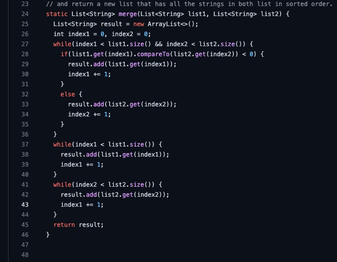
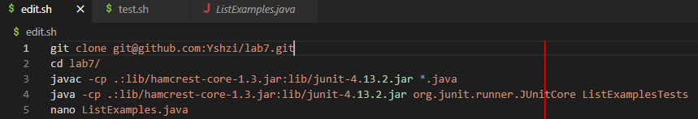
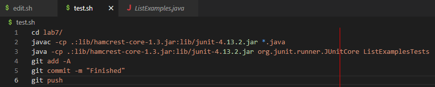
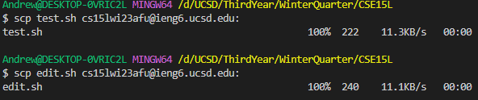
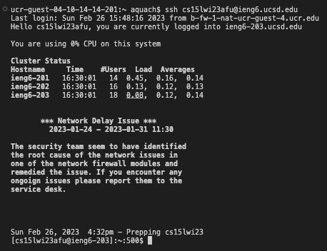
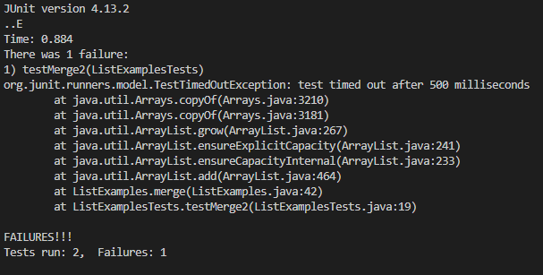
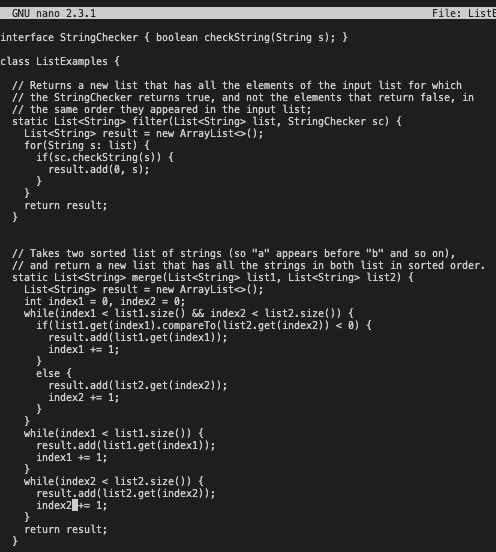
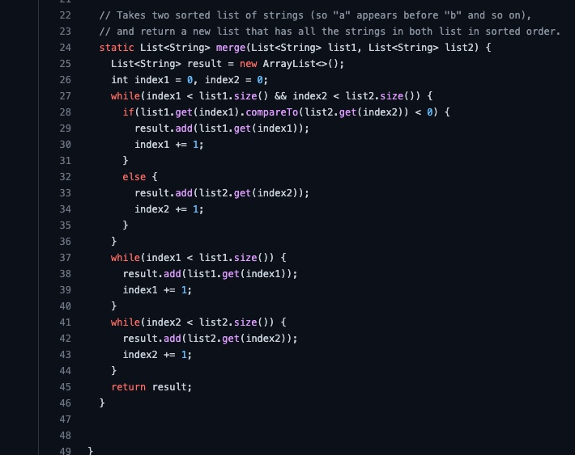

# Lab Report 5: Bash Scripting Lab Report 4
## Introduction:
Lab Report 4 required us to document all the commands that we did in lab to edit code and test its validity. In lab this was set up as a competition to see who could complete all the tasks the fastest. I really liked this lab and lab report because it makes the student go trough the process of thinking about the most efficient way to get the task done. While competing with others, I thought about how using a bash script might make the process even faster. So, we will now look into how to run the desired tasks in a bash script.
### Code Before:

### Setting Things Up:
#### Bash Scripts
First, we have to create the bash script that will complete the tasks.

In this bash script we clone the repository, compile the tester, run the tester, then enter the text editor nano.

In the second bash script we compile and run the tester again, then add, commmit and push to github to submit our changes to github.

#### Note:
Because these bash scripts are on our local computer and noit in the remote server we have to copy them over by using the `scp` command.

### Step 4: Log into ieng6

Because we have to edit the file in order for it to work, we have to log into the remote server manually first then run the bash scripts.

### Step 5, 6, and 7

By doing the first bash script edit.sh we clone the fork of the repositorym run the tests, and enter the code editor nano.  We run the script by using the command `bash edit.sh` All the commands will run and we have entered the nano editor. From there we have to do the key presses:  `<Ctrl-W> <ESC-B> <i> <enter> <right> <right> <right> <right> <right> <right> <backspace> <2> <Ctrl-O> <enter> <Ctrl-X>`. This will do a backwards search to look for the index1 that needs to be changed to index2. Then it will save the edit and then exit our of nano. Now we are halfway done.

### Step 8, and 9

Now we run the other bash script test.sh using the command `bash test.sh` which runs the Junit tests again, git add, git commit, and git push to github so that our changes are saved to github. 

### Code after:

Voila! You've succesfully edited code and submitted changes and ran Junit tests all from the terminal. We took soomething that previously took a very long five steps and condensed it down to rougly 3 steps. The hardest part was setting up the script, but after that it is very quick and easy to use. 
